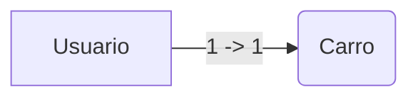

#  OrmJs 1.0.1

Mapeamento objeto-relacional com javascript 
Object Relational Mapping with javascript

# # Primeiro ORM feito em javascript para persistência de dados local com Web SQL.

O OrmJs é uma biblioteca leve que permite armazenar dados localmente pelo navegador com  [Web SQL]([https://developers.google.com/web/tools/chrome-devtools/storage/websql](https://developers.google.com/web/tools/chrome-devtools/storage/websql)), sem precisar usar instruções SQL, todas as consultas e inserções são feita de forma simples e elegante usando apenas orientação a objeto e conceitos de entidade representativas com **javascript**.

## Conectando em um banco de dados

para conectar em banco de dados basta informa seu nome com sua versão, você poderá passar também uma descrição para seu banco e o tamanho dele.

No código abaixo conecta cria ou acessa um banco de dados com nome "dbTeste".
```js
var ormJs = new dataBaseLocation("dbTeste","1.0.1");
ormJs.conectar();
```
No código abaixo passando uma descrição e um tamanho fixo no banco de dados o padrão é **2 MB**.
```js
var ormJs = new dataBaseLocation("dbTeste","1.0.1","DB Local com web SQL", (10*1024*2024)); //10 MB
ormJs.conectar();
```

## Criando uma entidade e salvando dados
Para criar um representação de sua tabela basta criar uma class com os atributos que será usado.
```js
class Usuario {
     Nome;
     Idade;
     Sexo;
}
```

> **Result:** 


|         rowId       |Nome                          |Idade                         |
|----------------|-------------------------------|-----------------------------|
|Single backticks|`'Isn't this fun?'`            |'Isn't this fun?'            |


## UML diagrams
Relacionando 1 para 1

